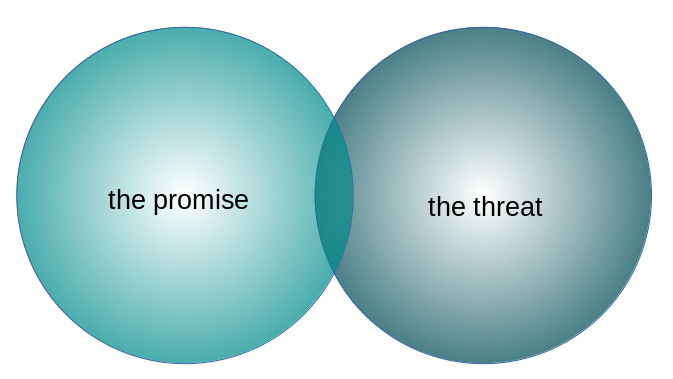
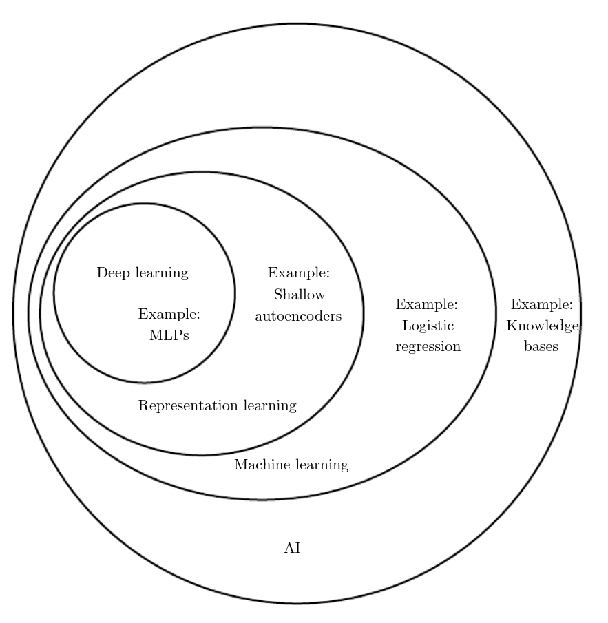
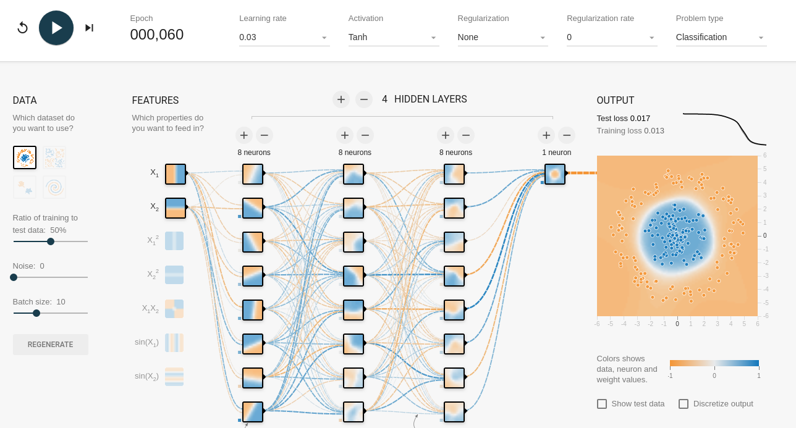
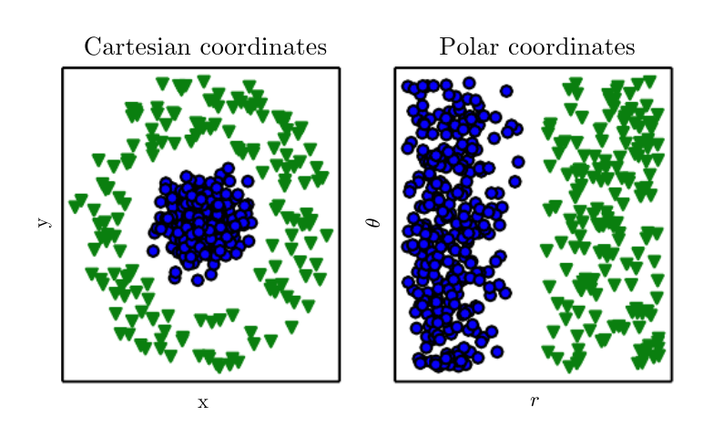
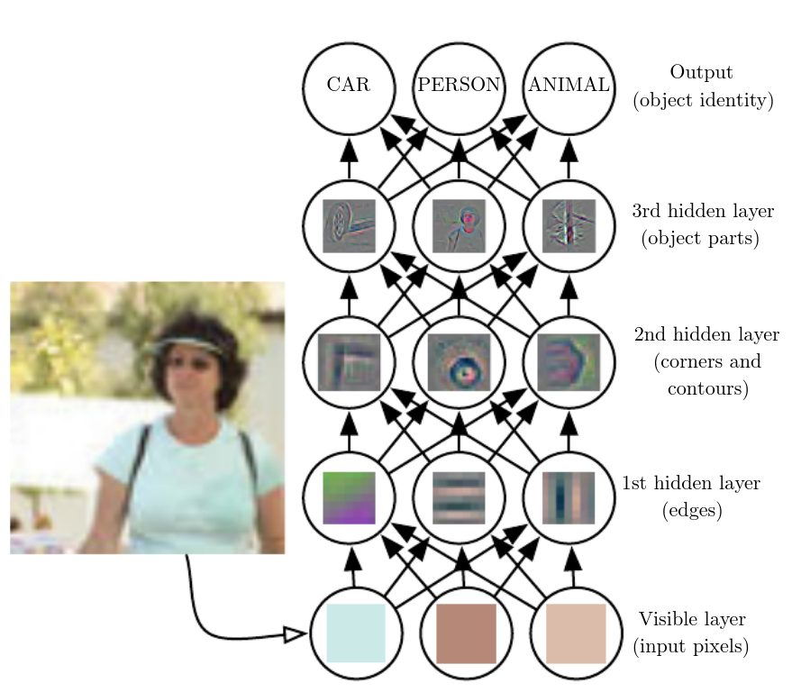
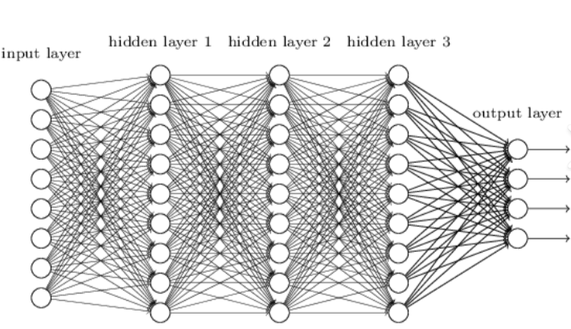
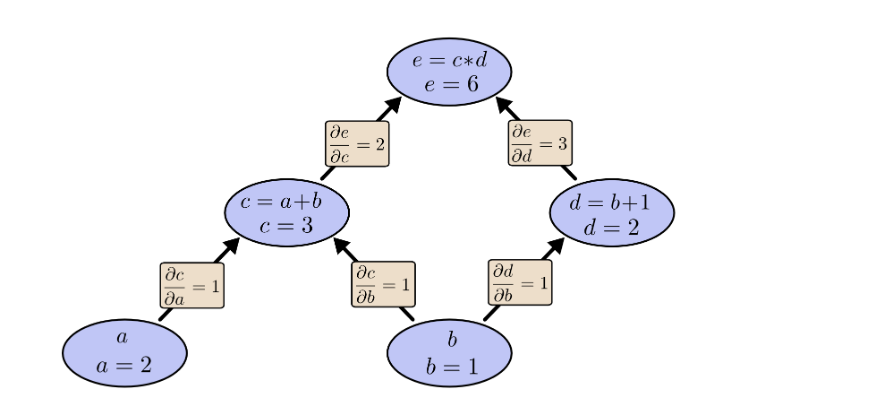
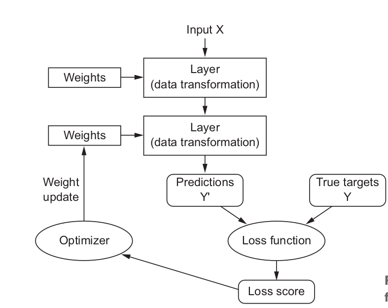

class: middle center section

# Talk deep learning, talk data


---

# The two faces of data 



---

# The promise

<br />


- Data-driven / empirical decision making (as opposed to ...)

- So many problems we could possibly solve ...

- _Deep learning_: Data + compute power + algorithms (+ ...?)

---

# The threat


- Lots of ways this can go wrong:

  - enhance inequality, broaden gaps
  
  - enhance disadvantages for those already discriminated against
  
  - enforce _bias_
  
- What can be biased:

  - data
  
  - algorithms
  
  - people, societies, systems ... 
  
  

---

# A few starting points 

(_from someone who's just starting herself_)


- [Timnit Gebru & Emily Denton, Tutorial on Fairness, Accountability, Transparency, and Ethics in Computer Vision at CVPR 2020](https://sites.google.com/view/fatecv-tutorial/schedule)

- [Ben Green, Data Science as Political Action: Grounding Data Science in a Politics of Justice.](https://arxiv.org/abs/1811.03435)

- [Decolonial AI: Decolonial Theory as Sociotechnical Foresight in Artificial Intelligence](https://arxiv.org/abs/2007.04068)

- ... and all the "classics": Ruha Benjamin, Race after Technology; C. Ignazio & L.F. Klein, Data Feminism ...


---
# That said:


<br />

> _"it's better to know than to not know"_

<br />

- Learning about deep learning is learning 

 - what is possible now

 - what could be possible soon
 
 - what to watch out for
 
 - what could be used to make this world better


---
class: middle center section

# What is deep learning?

---
# Situating deep learning

<figure>

<figcaption>Source: <a href="https://www.deeplearningbook.org/">Goodfellow et al.,  Deep Learning. 2016.</a></figcaption>
</figure>

---
# A neural network


<figure>

<figcaption><a href="https://playground.tensorflow.org/">TensorFlow playground</a></figcaption>
</figure>

---
# Representation matters

<figure>

<figcaption>Source: <a href="https://www.deeplearningbook.org/">Goodfellow et al.,  Deep Learning. 2016.</a></figcaption>
</figure>

---
# Why depth

<figure>

<figcaption>Source: <a href="https://www.deeplearningbook.org/">Goodfellow et al.,  Deep Learning. 2016.</a></figcaption>
</figure>

---
class: middle center section


# Meet the actors


---
# Layers of neurons

Neurons are units of computation, arranged in layers.


<figure>

</figure>

Each neuron aggregates the inputs from its incoming connections, transforms the aggregate, and passes it on to the next layer neurons. 


                      
---
# Activations


Activations are the actual _values_ passed from one neuron to another. 


                    
                            my output is 22.2
  
       layer 1, neuron 1 ---------------------> layer 2, neuron 1
                            
                            my output is -0.07
       
       layer 1, neuron 1 ---------------------> layer 2, neuron 2

             
Often activations are the result of applying an _activation function_ to the raw aggregate of incoming values.


---
# Loss 

<br />


The _loss_ is the difference between the target (ground truth) and network's output. 

<br />
                    
                      
                    
                            
  
       output neuron 1: I say 0.33  --------->  target: sorry, should be 25
                            
                           
       ---> absolute error is 24.67     
       ---> squared error is 608.6089
       ---> ...


---
# Weights
<br />


Weights are connection strengths _learned by_ the network.

<br />
                    
                      
                    
                            weight = 0.77
  
       layer 1, neuron 1 ---------------------> layer 2, neuron 1
                            
                            weight = 0.02
       
       layer 1, neuron 1 ---------------------> layer 2, neuron 2


---
# Optimization

The process of finding good weights, based on the current loss.

Updates are computed by an _optimizer_ and applied via _backprop_ (backpropagation).

<figure>

<figcaption>Source: <a href="https://colah.github.io/posts/2015-08-Backprop/">Chris Olah's post on backprop</a></figcaption>
</figure>


---
#  In a nutshell

<figure>

<figcaption>Source: F. Chollet & JJ Allaire, Deep Learning with R. 2018</figcaption>
</figure>


---
class: middle center section

# Deep learning with R

---
# TensorFlow / Keras - from R?

Yes!

- Website (installation, tutorials, guides ...): https://tensorflow.rstudio.com/tutorials/

- GitHub: https://github.com/rstudio/tensorflow, https://github.com/rstudio/keras

- Blog: https://blogs.rstudio.com/ai/

- Book (1st ed., 2018): F. Chollet & JJ Allaire, Deep Learning with R.

- YouTube: https://www.youtube.com/c/mlverse


---
# Install

```{r, eval=FALSE}
# install R packages
install.packages("tensorflow")
install.packages("keras")
install.packages("tfdatasets")

library(tensorflow)
# installs the Python backend
# by default, will create a dedicated Miniconda environment
# named r-reticulate
# if you don't have Miniconda installed, you'll be prompted whether
# reticulate may install it for you
install_tensorflow()

# what is the TensorFlow (Python) version,
# and what environment does it run in?
tensorflow::tf_config()
```

There is no separate installation of (Python) Keras required!

---
# Now let's assemble a neural network!  


They all look like penguins to me ...


<figure>

<figcaption>Artwork by @allisonhorst</figcaption>
</figure>


--- 
# 


---
class: middle center section

# What now?


---
# Participate!


